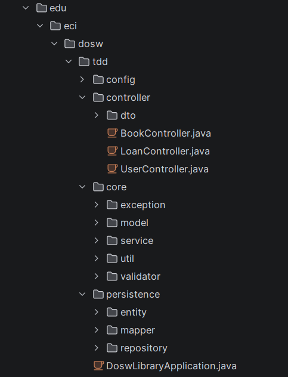
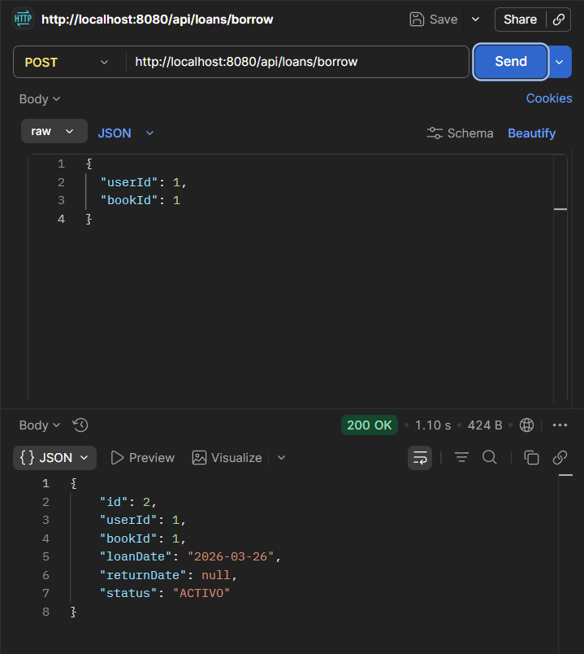
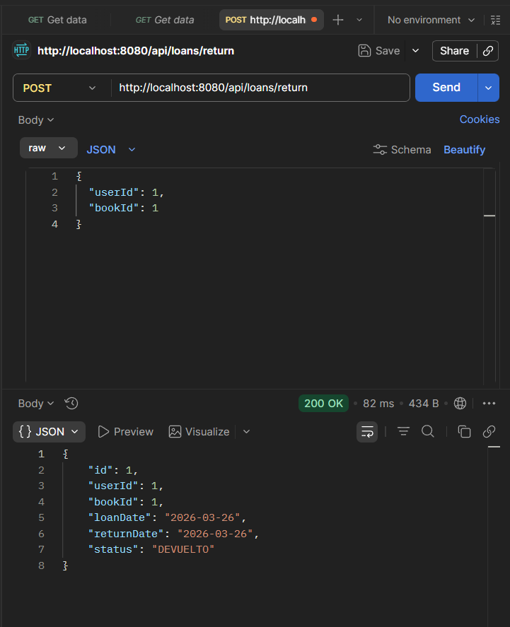
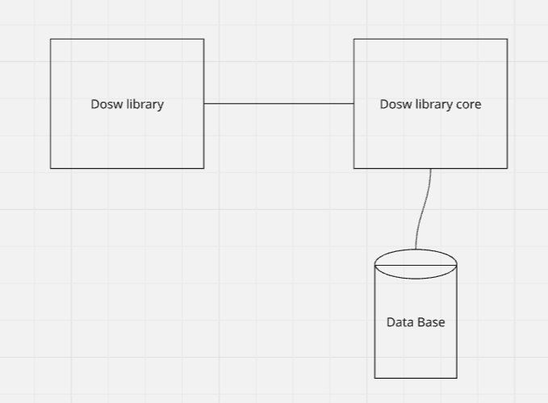
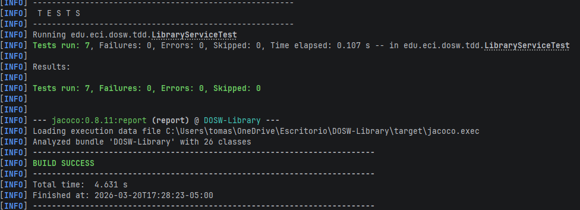
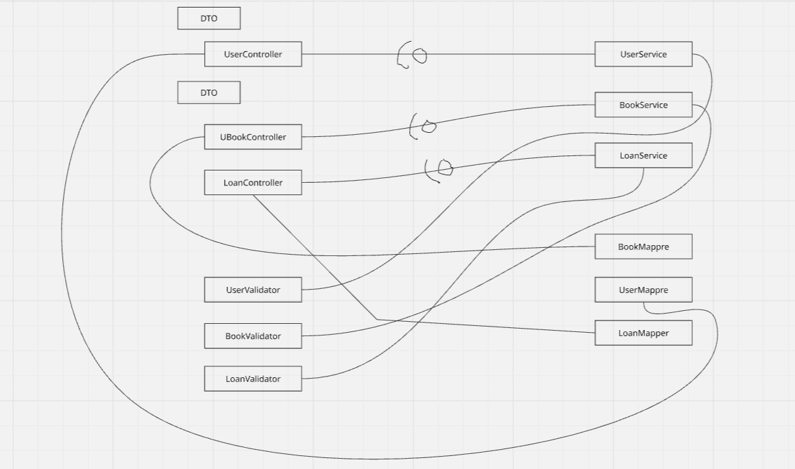

#  DOSW Library System

Sistema de gestión de biblioteca desarrollado en Spring Boot, que permite administrar libros, usuarios y préstamos.

---

##  Funcionalidades

-  Gestión de libros
-  Gestión de usuarios
-  Préstamo de libros
-  Devolución de libros
-  Control de stock disponible
-  Consulta de préstamos activos

---

##  Arquitectura

El proyecto está organizado en capas:

- **controller** → Manejo de endpoints REST
- **service** → Lógica de negocio
- **model** → Entidades del dominio
- **persistence** → Acceso a base de datos
- **dto** → Transferencia de datos

 
---

##  Tecnologías usadas

- Java 21
- Spring Boot
- Maven
- H2 / MySQL 
- Postman

---

##  Cómo ejecutar el proyecto

1. Clonar el repositorio:

- git clone: https://github.com/t0masespitia/DOSW-Library.git
- Abrir en IntelliJ
- Ejecutar:
mvn spring-boot:run
El servidor iniciará en:
http://localhost:8080
- Endpoints principales
- Libros
GET /api/books
POST /api/books
PUT /api/books/{id}
DELETE /api/books/{id}
- Usuarios
GET /api/users
POST /api/users
- Préstamos
- Crear préstamo

{
  "userId": 1,
  "bookId": 1
}

 Devolver libro

POST /api/loans/return

{
  "userId": 1,
  "bookId": 1
}

### Flujo del sistema
El usuario solicita un libro
Se valida disponibilidad
Se crea el préstamo
Se reduce el stock
El usuario devuelve el libro
Se actualiza el estado
Se incrementa el stock

---

