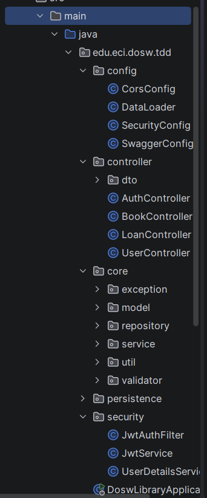

# DOSW Library System

Sistema de gestión de biblioteca desarrollado en Spring Boot, que permite administrar libros, usuarios y préstamos con soporte de persistencia dual (MongoDB Atlas y PostgreSQL).

---

## Funcionalidades

- Gestión de libros (CRUD completo)
- Gestión de usuarios
- Préstamo de libros con validación de stock
- Devolución de libros
- Control de stock disponible
- Consulta de préstamos activos
- Autenticación y autorización con JWT
- Documentación automática con Swagger UI

---

## Arquitectura

El proyecto sigue una arquitectura en capas con el patrón Ports & Adapters:

- **controller** → Manejo de endpoints REST
- **service** → Lógica de negocio
- **model** → Entidades del dominio
- **persistence** → Acceso a base de datos (relacional y no relacional)
- **dto** → Transferencia de datos
- **security** → Filtros JWT y configuración de Spring Security
- **config** → Configuraciones generales (Swagger, DataLoader)



---

## Tecnologías

| Tecnología | Uso |
|---|---|
| Java 21 | Lenguaje principal |
| Spring Boot 3.4.5 | Framework backend |
| Spring Security + JWT | Autenticación y autorización |
| MongoDB Atlas | Persistencia NoSQL (perfil `mongo`) |
| PostgreSQL | Persistencia relacional (perfil `relational`) |
| Springdoc / Swagger UI | Documentación de la API |
| Maven | Gestión de dependencias |
| Docker | Contenedorización |
| GitHub Actions | CI/CD pipeline |
| Azure App Service | Despliegue en nube |

---

## Cómo ejecutar el proyecto

### Requisitos previos
- Java 21
- Maven 3.x
- MongoDB Atlas (para perfil `mongo`) o PostgreSQL local (para perfil `relational`)

### Pasos

1. Clonar el repositorio:
```bash
git clone https://github.com/t0masespitia/DOSW-Library.git
cd DOSW-Library
```

2. Configurar el perfil de base de datos en `application.yaml`:
```yaml
spring:
  profiles:
    active: mongo   # o 'relational' para PostgreSQL
```

3. Ejecutar el proyecto:
```bash
mvn spring-boot:run
```

4. El servidor iniciará en:
   http://localhost:8080

5. Acceder a la documentación Swagger:
   http://localhost:8080/swagger-ui/index.html

---

## Endpoints principales

### Autenticación

| Método | Endpoint | Descripción | Acceso |
|---|---|---|---|
| POST | `/api/auth/login` | Iniciar sesión y obtener token JWT | Público |
| POST | `/api/auth/register` | Registrar nuevo usuario | Público |

**Ejemplo de login:**
```json
// Request
{
  "username": "admin",
  "password": "admin123"
}

// Response
{
  "token": "eyJhbGciOiJIUzI1NiJ9...",
  "username": "admin",
  "role": "BIBLIOTECARIO"
}
```

### Libros

| Método | Endpoint | Descripción | Rol requerido |
|---|---|---|---|
| GET | `/api/books` | Listar todos los libros | Autenticado |
| POST | `/api/books` | Agregar un libro | BIBLIOTECARIO |
| PUT | `/api/books/{id}` | Actualizar un libro | BIBLIOTECARIO |
| DELETE | `/api/books/{id}` | Eliminar un libro | BIBLIOTECARIO |

### Usuarios

| Método | Endpoint | Descripción | Rol requerido |
|---|---|---|---|
| GET | `/api/users` | Listar todos los usuarios | BIBLIOTECARIO |
| DELETE | `/api/users/{id}` | Eliminar un usuario | BIBLIOTECARIO |

### Préstamos

| Método | Endpoint | Descripción | Rol requerido |
|---|---|---|---|
| GET | `/api/loans` | Ver todos los préstamos | BIBLIOTECARIO |
| POST | `/api/loans/borrow` | Crear un préstamo | USER / BIBLIOTECARIO |
| POST | `/api/loans/return` | Devolver un libro | USER / BIBLIOTECARIO |

**Ejemplo de préstamo:**
```json
// POST /api/loans/borrow — Request
{
  "username": "juan",
  "bookIsbn": "9780132350884"
}

// Response 200 OK
{
  "id": "abc123",
  "userId": "juan",
  "bookId": "9780132350884",
  "loanDate": "2026-04-09",
  "returnDate": null,
  "status": "ACTIVE"
}
```

**Ejemplo de devolución:**
```json
// POST /api/loans/return — Request
{
  "username": "juan",
  "bookIsbn": "9780132350884"
}

// Response 200 OK
{
  "id": "abc123",
  "userId": "juan",
  "bookId": "9780132350884",
  "loanDate": "2026-04-09",
  "returnDate": "2026-04-15",
  "status": "RETURNED"
}
```

---

## Flujo del sistema

El usuario se autentica → obtiene token JWT
El usuario consulta el catálogo de libros disponibles
El usuario solicita un préstamo (username + ISBN)
El sistema valida disponibilidad de stock
Se crea el préstamo con estado ACTIVE
Se reduce el stock disponible del libro
El usuario devuelve el libro
El préstamo cambia a estado RETURNED
Se incrementa el stock disponible del libro


---

## Seguridad

- Autenticación basada en **JWT** (JSON Web Token)
- Expiración del token: **8 horas**
- Roles disponibles: `USER` y `BIBLIOTECARIO`
- Rutas públicas: `/api/auth/**`, `/swagger-ui/**`, `/v3/api-docs/**`
- Contraseñas almacenadas con **BCrypt**

### Usuarios de prueba (cargados automáticamente)

| Username | Password | Rol |
|---|---|---|
| juan | 123456 | USER |
| admin | admin123 | BIBLIOTECARIO |

---

## CI/CD Pipeline

El pipeline de GitHub Actions se activa automáticamente con cada Pull Request hacia `main` y ejecuta 4 jobs en secuencia:
Build → Test → Analysis → Deploy

| Job | Acción | Herramienta |
|---|---|---|
| Build | Compilar y empaquetar el JAR | `mvn package -DskipTests` |
| Test | Ejecutar suite de pruebas | `mvn verify` |
| Analysis | Análisis estático de código | `mvn checkstyle:check` |
| Deploy | Despliegue en Azure App Service | `az webapp deploy` |

---

## Despliegue en Azure

- **App Service:** `dosw-libreria`
- **URL de producción:**
  https://dosw-libreria-dfgvfsfjb6euanen.canadacentral-01.azurewebsites.net/swagger-ui/index.html
- **Plan:** F1 Gratuito · Linux · Canada Central · Java 21

---

## Evidencias


